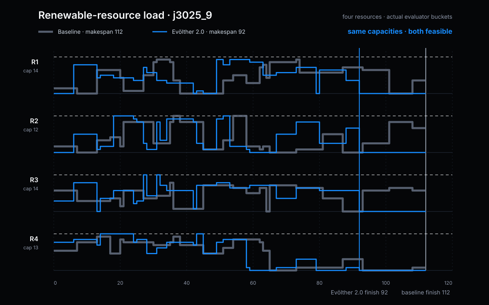
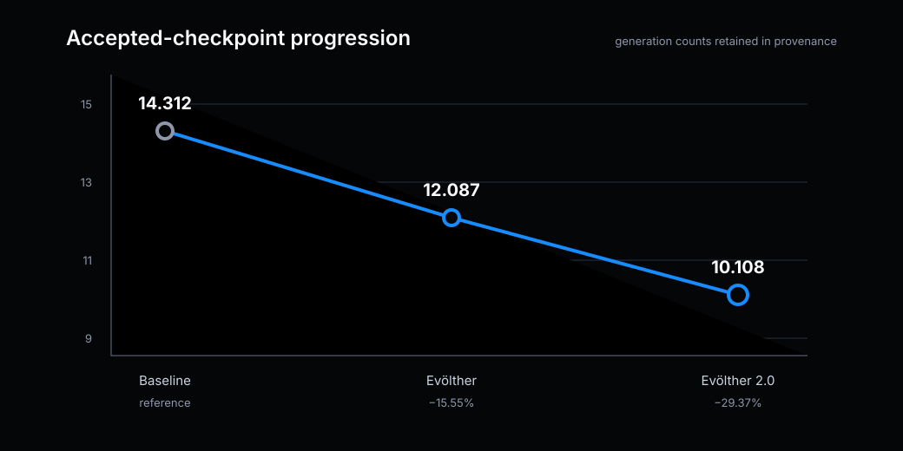
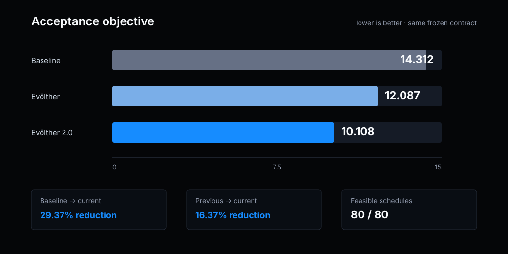
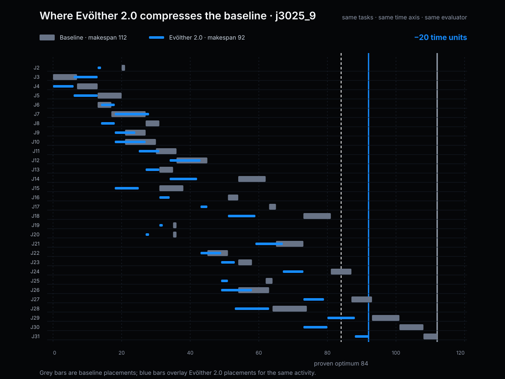
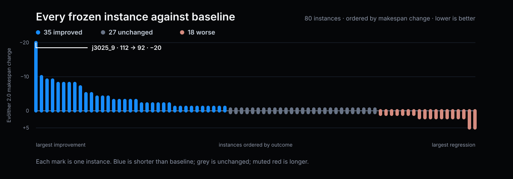
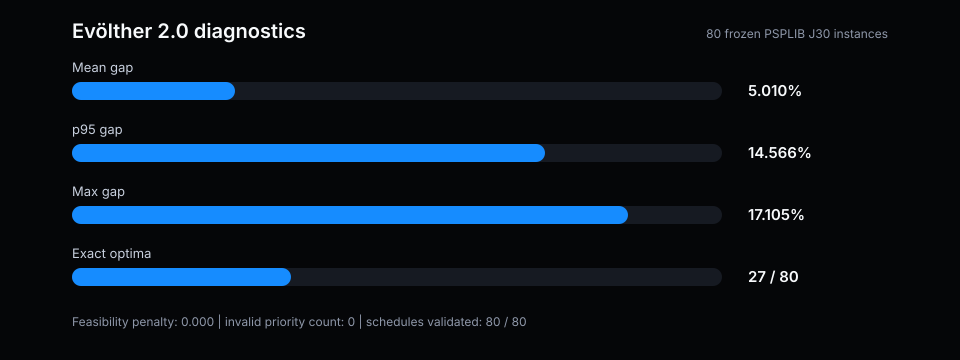
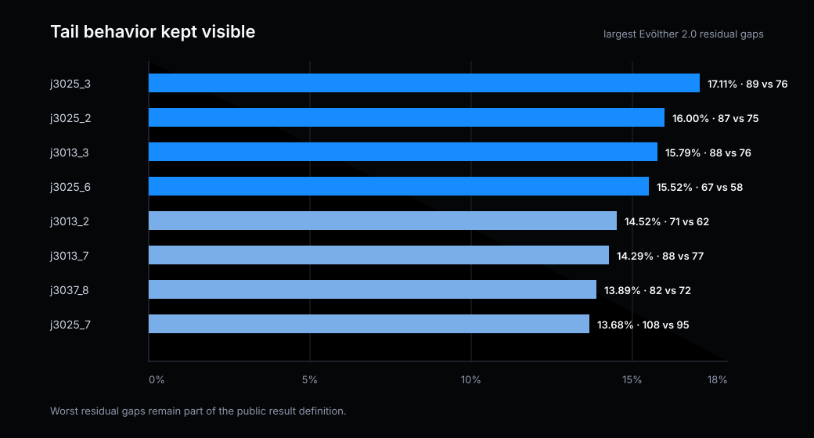

# PSPLIB J30 scheduling benchmark

[Published web article](https://www.gotherlabs.com/results/rcpsp-psplib-j30/) · [Structured metadata](result.json) · [Evaluation contract](artifacts/evaluation_contract.md) · [Accepted candidate](artifacts/accepted_candidate.py) · [Baseline diff](artifacts/baseline-to-evolther-2.diff)

## Abstract

This note reports a deterministic dispatch rule for the Resource-Constrained Project Scheduling Problem (RCPSP). On a frozen public subset of PSPLIB J30, the accepted score progressed from 14.312 at baseline to 12.087 with Evölther and 10.108 with Evölther 2.0. The current result is a 29.37% reduction from baseline and preserves feasibility on all 80 evaluated instances.

The result history is expressed as accepted checkpoints rather than placed on a synthetic generation axis. Every portfolio instance has a proven optimal makespan, so the score measures schedule quality against a reference optimum rather than machine speed. This is a benchmark result on the fixed portfolio, not a universal scheduling claim.

## 1. Problem formulation

RCPSP schedules activities subject to precedence constraints and renewable-resource limits. An activity may start only after all predecessors finish, and concurrent demand must remain within available capacity. The objective is the terminal makespan.

$$
C_{max}(S) = \max_i F_i
$$

The two resource profiles use the real j3025_9 schedules. Evölther 2.0 redistributes demand earlier without crossing any unchanged capacity limit and releases all resources 20 time units sooner. Evölther changes the priority policy, not the feasibility validator.

## 2. Benchmark and evaluation contract

The public portfolio contains 80 frozen PSPLIB J30 single-mode instances: parameters 1, 7, 13, 19, 25, 31, 37, and 43 crossed with instances 1 through 10. Every instance has 32 jobs including dummy source and sink activities and a proven optimal makespan.

For instance \(k\):

$$
g_k = 100 \cdot \frac{C_{max,k}^{candidate} - C_{max,k}^{optimal}}{C_{max,k}^{optimal}}
$$

and the frozen, lower-is-better objective is:

$$
score = mean(g_k) + 0.35 \cdot p95(g_k) + feasibility\_penalty.
$$

See the complete [evaluation contract](artifacts/evaluation_contract.md).

## 3. Accepted candidate

Evölther 2.0 keeps the serial schedule generator unchanged and replaces only the deterministic activity-ranking policy. The complete public code boundary is visible in the [baseline-to-Evölther 2.0 diff](artifacts/baseline-to-evolther-2.diff).

Each feature was removed independently and the 80-instance portfolio replayed. Every ablation worsened the score; see [ablation.json](artifacts/ablation.json).

## 4. Results

| Metric | Baseline | Evölther | Evölther 2.0 |
|---|---:|---:|---:|
| Acceptance score | 14.312 | 12.087 | 10.108 |
| Mean gap | 7.13% | 6.04% | 5.01% |
| P95 gap | 20.52% | 17.28% | 14.57% |
| Exact optima | 23 / 80 | 19 / 80 | 27 / 80 |
| Feasible schedules | 80 / 80 | 80 / 80 | 80 / 80 |

Evölther 2.0 is 29.37% below baseline and 16.37% below the previous public incumbent. Against baseline it improves 35 instances, leaves 27 unchanged, and worsens 18.

For j3025_9, makespan contracts from 112 to 92 against a proven optimum of 84. The reduction removes 71.4% of the baseline gap.

The complete per-instance ledger is [portfolio-comparison.json](artifacts/portfolio-comparison.json). It keeps the 18 regressions visible alongside the 35 improvements and 27 ties.

## 5. Limitations

This result is limited to the frozen 80-instance PSPLIB J30 subset. It does not claim evaluation over all 480 J30 instances, measure production integration behavior, or establish robustness under different project distributions. Other project classes, resource models, or operational policies require a new evaluation contract.

## 6. Reproducibility

The bundle includes the accepted candidate, baseline diff, evaluation contract, accepted-checkpoint ledger, metrics, deterministic replay, all 80 instance comparisons, feature ablations, and the real j3025_9 schedules and resource profiles.

- [metrics.json](artifacts/metrics.json)
- [evolution.json](artifacts/evolution.json)
- [replay.json](artifacts/replay.json)
- [provenance.json](artifacts/provenance.json)
- [schedule-example.json](artifacts/schedule-example.json)
- [portfolio-comparison.json](artifacts/portfolio-comparison.json)
- [ablation.json](artifacts/ablation.json)

The older animated campaign surface remains in the repository as historical material; it is not the generation axis for Evölther 2.0.
